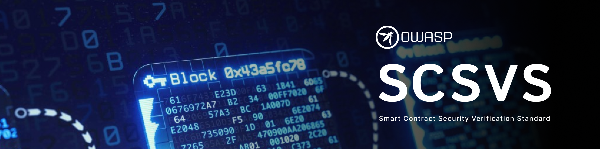

# OWASP スマートコントラクトセキュリティ検証標準

## はじめに

OWASP Smart Contract Security Verification Standard (SCSVS) プロジェクトの主な目的は、安全なスマートコントラクトを設計、構築、テストするためのオープンなセキュリティ標準を提供することです。

本標準は、スマートコントラクト、分散型アプリケーション (dApps)、EVM ベースのブロックチェーンシステムに関連する特定のセキュリティリスクと懸念に対処するガイドラインを提供し、スマートコントラクト開発におけるセキュリティの中核となる原則に焦点を当てています。

私たちは、多大な時間を割いたり、資金面でプロジェクトを支援してくださった団体を「[サポーター](https://github.com/OWASP/www-project-smart-contract-security-verification-standard/blob/main/SUPPORTERS.md)」ページで感謝の意を表します！

**バグを見つけたりアイデアがある場合は [issues を記録](https://github.com/OWASP/www-project-smart-contract-security-verification-standard/issues) してください。その後、issue での議論に基づいて [プルリクエストを開く](https://github.com/OWASP/www-project-smart-contract-security-verification-standard/pulls) ようにお願いすることがあります。**

## 初期ドラフトバージョン - 0.0.1

最新の安定バージョンはバージョン 0.0.1 (2024 年 9 月付) で、以下にあります。

* [OWASP Smart Contract Security Verification Standard 0.0.1 English (PDF)](https://github.com/OWASP/www-project-smart-contract-security-verification-standard/releases/download/v0.0.1/OWASP_Smart_Contract_Security_Verification_Standard-0.0.1_en.pdf)

このリポジトリのマスターブランチは常に "bleeding edge version" となり、進行中の変更やその他の編集が開いている可能性があります。

## 標準の目標

要件は以下の目的を念頭に置いて策定されました。

1. **セキュリティガイドラインの策定と改良**: 一般的なセキュリティプラクティスを、スマートコントラクト開発者とセキュリティ専門家のための包括的なガイドラインセットに統合します。
2. **スマートコントラクト特有のセキュリティ課題への対処**: 再入可能性、オーバーフロー/アンダーフロー、ガス最適化、経済的攻撃などの脆弱性に特に焦点を当てます。
3. **開発チームにセキュアプラクティスの指導**: スマートコントラクト開発におけるセキュアコーディングプラクティスを実施するための開発者に詳細なガイダンスを提供します。
4. **セキュリティチームに監査とペネトレーションテストの支援**: ブロックチェーンのデータ完全性、アクセス制御、ビジネスロジックなど、効果的なスマートコントラクトの監査とペネトレーションテストの方法論を提供します。
5. **セキュリティベンチマークの確立と更新**: ブロックチェーンエコシステムとスマートコントラクトセキュリティの進化する性質を反映するためにセキュリティベンチマークを作成して定期的に更新します。
6. **スマートコントラクトセキュリティのベストプラクティスの推進**: スマートコントラクト環境を保護するために、防御コーディング、形式検証、テスト駆動開発などのベストプラクティスの採用を奨励します。
7. **利害関係者の間でのセキュリティに対する期待の一致**: 開発者、監査人、ブロックチェーンプラットフォーム、分散型金融 (DeFi) ユーザーのセキュリティに対する期待について共通の理解を確立します。

## ライセンス

プロジェクトのコンテンツ全体は **[Creative Commons Attribution-Share Alike v4.0](LICENSE.md)** ライセンスの下にあります。
